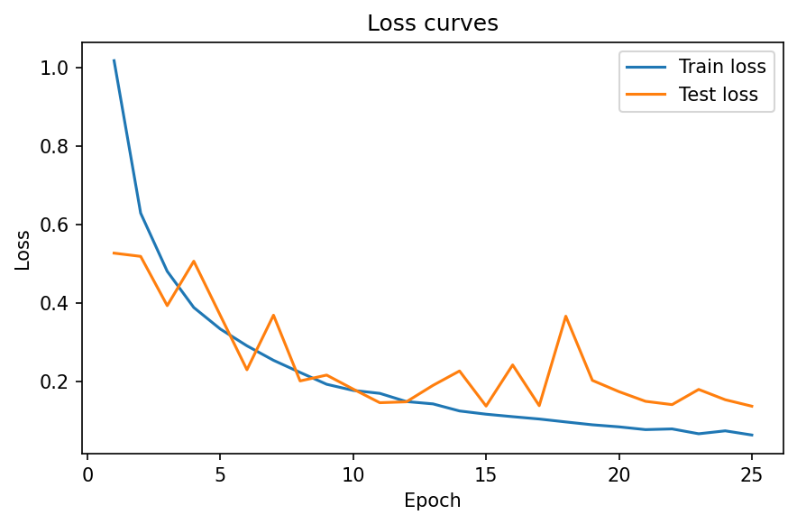
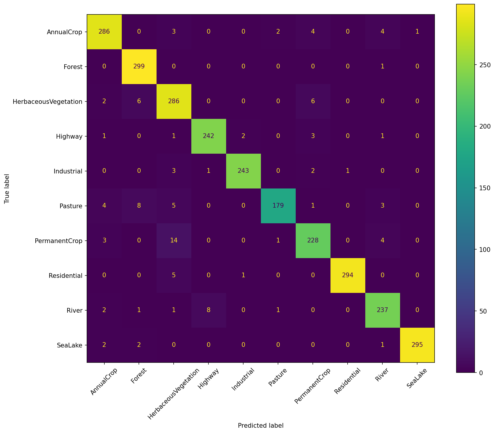
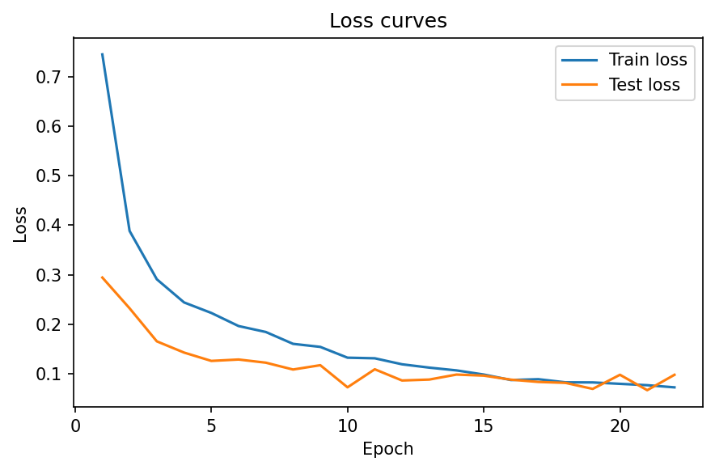
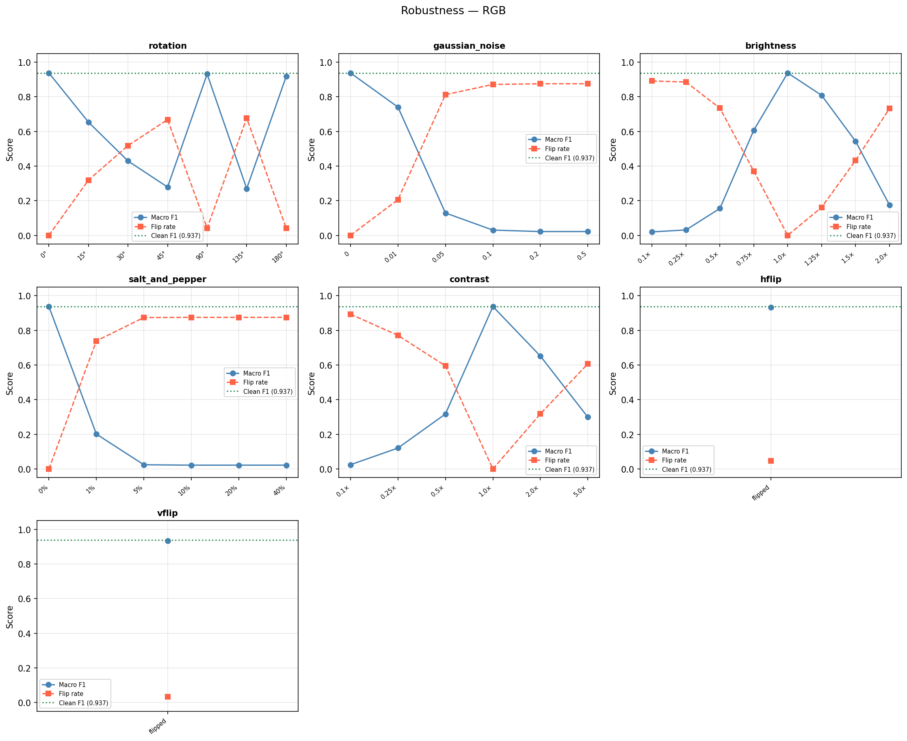
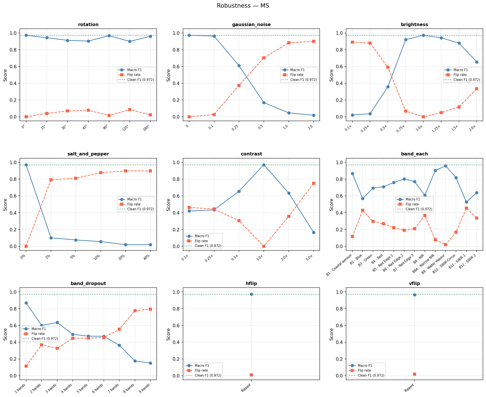
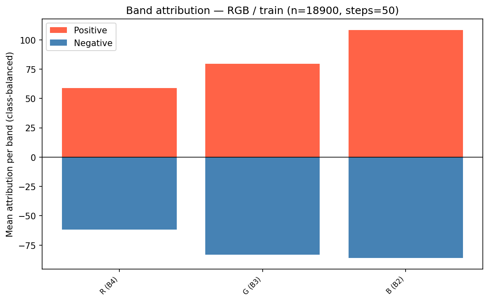
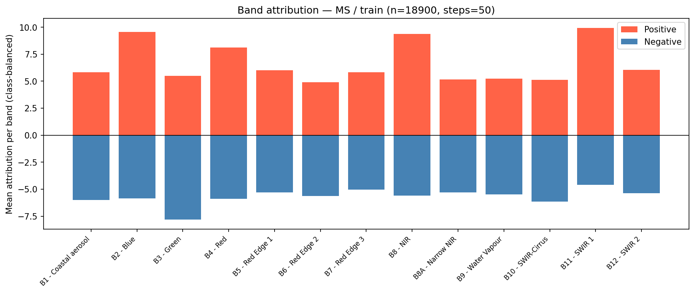

# EuroSAT Land-Use Classification — Applied Machine Learning Project - Group 11

A configurable convolutional neural network trained on the [EuroSAT](https://github.com/phelber/EuroSAT) satellite imagery dataset, with hyperparameter search via [Optuna](https://optuna.org/). Supports both the **RGB** (3-channel JPEG) and **multispectral** (13-band TIFF) variants of the dataset, taken as baseline and final models, respectively.

---

## Table of Contents

1. [Project Overview](#project-overview)
2. [Project Structure](#project-structure)
3. [Prerequisites](#prerequisites)
4. [Reproducing the Project Locally](#reproducing-the-project-locally)
5. [Running the API](#running-the-api)
6. [Running the Streamlit Demo](#running-the-streamlit-demo)
7. [Results & Evaluation](#results--evaluation)

---

## Project Overview

- **Input**: 64x64 pixel satellite image with 10 meter ground sampling distance
- **Output**: Land type classification prediction from 10 possible classes:
  - AnnualCrop
  - Forest
  - HerbaceousVegetation
  - Highway
  - Industrial
  - Pasture
  - PermanentCrop
  - Residential
  - River
  - SeaLake

---

## Project Structure

```
.
├── eurosat_classification/
│   ├── data/
│   │   ├── datasets.py                    # PyTorch Datasets + DataLoaders
│   │   ├── download.py                    # Downloads EuroSAT via kagglehub
│   │   ├── split.py                       # Train/val/test splitting
│   │   ├── clean.py                       # SeaLake folder cleanup
│   │   ├── label_map.py                   # Label map for class names
│   │   ├── band_names.py                  # MS band names and indices
│   │   └── preprocessors.py               # MS-band normalisation
│   ├── models/
│   │   └── cnn.py                         # CNN, CNNConfig, ConvBlockConfig
│   ├── features/                          # Explainability & Band attributions
│   │   ├── gradcam.py                     # Grad-CAM
│   │   ├── integrated_gradients.py        # Integrated gradients
│   │   ├── band_attribution_runner.py     # Calculated attribution per band
│   │   ├── alignment_scores.py            # Calculates alignment of band attribution with literature
│   │   ├── band_attribution_total.sh      # SLURM: whole-dataset attribution
│   │   ├── band_attribution_per_class.sh  # SLURM: per-class attribution (all 10 classes)
│   │   ├── test_files/                    # Satellite images for testing
│   │   └── retrieve_model.py              # Loads a saved model from .pkl
│   ├── notebooks/                         # Preprocessing experiments
│   ├── robustness/                        # Preprocessing experiments
│   │   ├── evaluate.py                    # Evaluation of robustness experiments
│   │   ├── perturbations.py               # Perturbation functions to test robustness
│   │   ├── run_robustness.py              # Robustness evaluation + plot creation
│   │   └── run_robustness.sh              # SLURM submission script
│   └── train/
│       ├── train.py                       # train_model() + evaluate()
│       ├── tune.py                        # Optuna search
│       ├── run_training.py                # Trains best config + saves the model
│       ├── compare_models.py              # Trains model several runs to obtain mean & SEM
│       ├── ablation.py                    # Trains model without certain bands removed
│       └── hyperparameters.sh             # SLURM submission script
├── tests/                                 # unittests
├── models/                                # Trained models land here
├── docker/                                # Dockerfile for containerization
├── logs/slurm/                            # SLURM job outputs (.out)
├── pyproject.toml                         # Project + Dependencies
├── uv.lock                                # Locked dependency versions
├── app.py                                 # Streamlit demo
└── main.py                                # FastAPI app
```

---

## Prerequisites

- **Python ≥ 3.12** (`pyproject.toml`)
- uv for environment and dependency management
- Docker

Install uv:

```bash
curl -LsSf https://astral.sh/uv/install.sh | sh
```

### Installation

```bash
git clone https://github.com/Juliuspotrykus/Applied-ML-Group11.git
cd Applied-ML-Group11
uv sync
source .venv/bin/activate
```

---

## Reproducing the Project Locally

### Data

The EuroSAT dataset is pulled automatically
from Kaggle via `kagglehub` the first time the dataloaders. It's cached locally, so
subsequent runs reuse it.

The multispectral contains some spurious files in the
`EuroSATallBands/SeaLake` folder. These are removed automatically by
`clean_sealake_folder()` before the datasets are constructed.

To download and clean the data independently, e.g. to inspect it before training, start a Python session and run:

```python
from eurosat_classification.data.download import get_dataset_path
from eurosat_classification.data.clean import clean_sealake_folder

path = get_dataset_path()
clean_sealake_folder()
```

### Usage

#### Hyperparameter tuning

`tune.py` runs an Optuna study for one image modality at a time, maximising validation macro-F1. It prints the best F1 and parameters.

Run locally:

```bash
uv run python -m eurosat_classification.train.tune rgb
uv run python -m eurosat_classification.train.tune ms
```

#### Training the final model

`run_training.py` holds the best hyperparameters found by tuning (`BEST_PARAMS`), retrains on them, and saves the trained model plus a loss/F1 plot to `models/<modality>_model_final.pkl` (and `.png`):

```bash
uv run python -m eurosat_classification.train.run_training rgb
uv run python -m eurosat_classification.train.run_training ms
```

#### Running on a SLURM cluster

`hyperparameters.sh` (eurosat_classification/train/hyperparameters.sh) submits a single-modality run to a GPU partition. Submit one job per modality so each gets its own wall-time budget and runs in parallel:

```bash
sbatch --job-name=tune_rgb eurosat_classification/train/hyperparameters.sh rgb
sbatch --job-name=tune_ms  eurosat_classification/train/hyperparameters.sh ms
```

To train the final model on train+validation data you can run:

```bash
sbatch --job-name=train_rgb --time=1:00:00 --mem=32GB --nodes=1 --ntasks=1 \
  --partition=gpu --gpus-per-node=rtx_pro_6000:1 --cpus-per-task=8 \
  --output=logs/slurm/%x-%j.out \
  --wrap="module load Python/3.13.5-GCCcore-14.3.0; source .venv/bin/activate; \
          python -u -m eurosat_classification.train.run_training rgb"
```

Swap `rgb` for `ms` to train the multispectral model. The saved model and plots
land in `models/`.

#### Comparing the models

`compare_models.py` retrains a model from scratch on the combined train+val set,
evaluates on the test set, and repeats this for `--n-runs` runs, reporting the
**mean and standard error** of the test macro-F1. Pass a single modality to run
it as its own job, or `both` to run RGB then MS sequentially:

```bash
uv run python -m eurosat_classification.train.compare_models rgb  --n-runs 100
uv run python -m eurosat_classification.train.compare_models ms   --n-runs 100
```

How to run on a SLURM cluster:

```bash
sbatch --job-name=compare_rgb --time=8:00:00 --mem=32GB --nodes=1 --ntasks=1 \
  --partition=gpu --gpus-per-node=rtx_pro_6000:1 --cpus-per-task=8 \
  --output=logs/slurm/%x-%j.out \
  --wrap="module load Python/3.13.5-GCCcore-14.3.0; source .venv/bin/activate; \
          python -u -m eurosat_classification.train.compare_models rgb --n-runs 100"
```

#### Ablation studies (only for MS bands)

`ablation.py` drops one or more multispectral bands from the input, retrains, and
reports the mean ± SEM test macro-F1 over `--n-runs` runs. With no `--drop` flag it
trains on all 13 bands as a baseline. Each `--drop` flag defines one experiment
(a single band or a group). The valid band tokens are `B1 B2 B3 B4 B5 B6 B7 B8 B8A B9 B10 B11 B12`:

```bash
# All bands:
uv run python -m eurosat_classification.train.ablation --n-runs 40

# Drop B1 alone, and drop B2/B3/B4 together, as two experiments:
uv run python -m eurosat_classification.train.ablation \
    --drop B1 --drop B2 B3 B4 --n-runs 40
```

#### Robustness evaluation

`run_robustness.py` runs the robustness evluation for both RGB and MS classifiers. Pertubations for RGB include `rotation`, `gaussian_noise`, `brightness`, `salt_and_pepper`, `contrast`. Additionally, for MS it evaluates `band_each` which drops each band individually and `band_dropout` which drops bands cummulatively. 

To change the severity, modify them in list of pertubation specs in `run_robustness.py`.

```bash
# For RGB: 
python -m eurosat_classification.robustness.run_robustness rgb
#For MS:
python -m eurosat_classification.robustness.run_robustness ms
```

#### Band attribution & literature alignment

The file `band_attribution_runner` iterates over the training set, accumulates total positive and negative IG
attributions per band (using each image's true label as the target class),
saves results to .npz, and writes a bar chart. You can specify the target class to only accumulate attribution for one class with the flag `--target_class`. The valid tokens are integers indexes `[0,12]`. 

```bash
#Local usage
python -m eurosat_classification.features.band_attribution_runner \
        --model_path models/ms_model_final.pkl \
        --image_type ms \
        --output_dir results/band_attribution \

#Usage on Habrok cluster (per class) --> runs for each class
sbatch eurosat_classification/features/band_attribution_per_class.sh \
    ms models/ms_model_final.pkl

#Usage on Habrok cluster (total) --> returns total attriubtion
sbatch eurosat_classification/features/band_attribution_per_class.sh \
    ms models/ms_model_final.pkl
```

To run the literature alignment:


```bash
python -m eurosat_classification.features.alignment_scores
```
##### IMPORTANT: band_attribution_runner.py needs to have been run before this!


---


## Running the API

### Option A: Using FastAPI

From the project root, run:

```bash
uvicorn main:app --reload
```

#### Access the API

Open the following link in your browser: `http://127.0.0.1:8000`

### Option B: Using Docker

From the project root, run:

```bash
docker build -f docker/Dockerfile -t eurosat-api .
docker run -p 8000:8000 eurosat-api
```

#### Access the API

Open the following link in your browser: `http://localhost:8000`

---

## Running the Streamlit Demo

Interactive, user-friendly, tool for uploading satellite images, running predictions, and visualizing explainability.

### Make sure the API is running

Start it via FastAPI or Docker (see above).

### Start the Streamlit App

From the project root, run:

```bash
streamlit run app.py
```

### Use the app through the website opened

1. Select "RGB" or "Multispectral" mode
2. Upload satellite image
3. Click Submit
4. View prediction and confidence
5. (Optionally) Select target class to explain
6. View explainability outputs

---

## Results & Evaluation

### Final model performance

| Modality              | Channels | Test macro-F1 |
| --------------------- | -------- | ------------- |
| RGB (baseline)        | 3        | 0.958         |
| Multispectral (final) | 13       | 0.976         |

#### RGB model

**Training curves**



**Confusion matrix**



#### Multispectral model

**Training curves**



**Confusion matrix**


### Statistical comparison

`compare_models` retrains each modality 100× and reports mean ± SEM. The better performance of the multispectral model's over RGB is consistent across runs. @TODO

### Ablation (MS bands, 40 runs each)

Dropping individual bands barely moves the score. The largest drop in performance comes from removing the visible bands (RGB) together
(B2/B3/B4):

| Configuration             | Test macro-F1       |
| ------------------------- | ------------------- |
| All 13 bands (baseline)   | 0.9786 ± 0.0005     |
| Drop B7                   | 0.9792 ± 0.0005     |
| Drop B5                   | 0.9791 ± 0.0006     |
| Drop B9                   | 0.9788 ± 0.0007     |
| Drop B10 / B6 / B8A / B12 | ≈ 0.9780–0.9782     |
| Drop B1                   | 0.9765 ± 0.0009     |
| **Drop B2, B3, B4**       | **0.9720 ± 0.0006** |

### Robustness





### Band attribution & literature alignment
#### Total band attribution for RGB


#### Total band attribution for MS



#### Alignment Scores

| Class                | Alignment Score |
| -------------------- | --------------- |
| AnnualCrop           | 0.568           |
| Forest               | 0.479           |
| HerbaceousVegetation | 0.383           |
| Highway              | 0.409           |
| Industrial           | 0.392           |
| Pasture              | 0.511           |
| PermanentCrop        | 0.509           |
| Residential          | 0.409           |
| River                | 0.363           |
| SeaLake              | 0.332           |
| **Mean alignment**   | **0.435**       |
